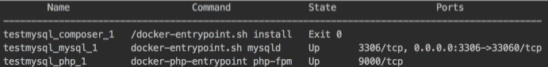

1. Устанавливаем [Docker](https://www.docker.com/community-edition). 
1. Клонируем репозиторий: `git clone https://github.com/postfriday/sql-test`
1. Переходим в папку проекта: `cd sql-test`
1. Поднимаем сервис Docker: `docker-compose up -d && docker-compose logs -f composer && docker-compose ps`
1. Дождаться выполнения *composer install*. Если сервис поднялся успешно, то в консоли наблюдаем следующую картину: 
1. Выполняем миграции: `docker-compose exec php php vendor/bin/phinx migrate`
1. Сидируем данные: `docker-compose exec php php vendor/bin/phinx seed:run`
1. Подключаемся к БД с помощью клиента на `localhost:33060` (login: `homestead`, password: `secret`)
1. Выполняем тестовое задание.
1. Выключаем проект: `docker-compose down`